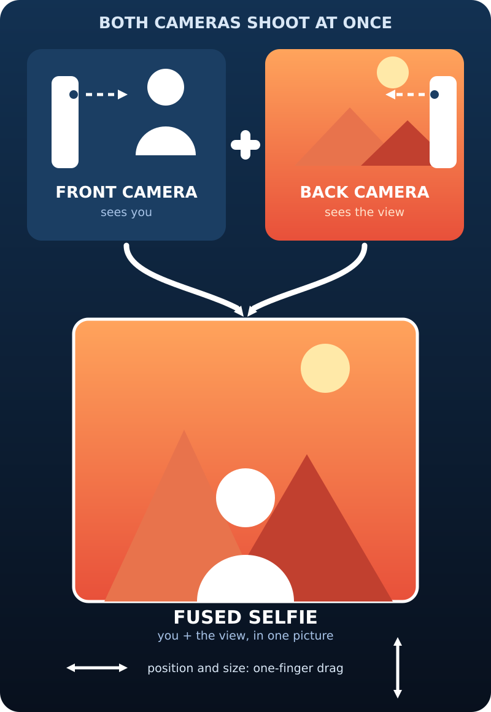

# SelfieFusion

<table>
  <tbody>
    <tr>
      <td width="600" valign="top">
        <a href="docs/concept.svg"></a>
      </td>
      <td valign="top">
        <strong>You don't have to turn your back to the background you actually want in the picture.</strong><br><br>See yourself and what you're looking at — in one picture. A normal selfie has a built-in blind spot: the front camera faces <em>you</em>, so the view you're actually looking at never makes it into the photo — the only workaround is turning around, which means the camera no longer faces you. SelfieFusion removes that blind spot. While you take a selfie, <strong>both phone cameras shoot at the same time</strong> — the front camera captures you, the back camera captures the scene in front of you — and the app fuses both into a single full-resolution photo.<br><br>The result looks like a picture taken <em>of</em> you standing in that scene: you in the foreground, the view you were facing as the backdrop — as if someone else had photographed you.<br><br><em>Arrange it live: one-finger drag gestures adapt the person's position and size — what you arrange is what you get.</em>
      </td>
    </tr>
  </tbody>
</table>


Under the hood, SelfieFusion is an Android app that streams the front and back cameras concurrently (on devices with concurrent-camera support), segments the person from the front-camera feed entirely on-device, and composites them live over the rear-camera scene — you watch the fused selfie take shape in real time before you press the shutter.

## Features

- **Dual-camera live preview** — front + back cameras stream simultaneously via CameraX `ConcurrentCamera`
- **On-device segmentation** — ML Kit Selfie Segmentation, works fully offline, no cloud
- **Grounded person gestures** — in Composite mode the person always stays realistic: its bottom edge is locked to the bottom of the frame, so it never floats in empty space. One finger moves it sideways, a vertical drag resizes it (top edge follows your finger), two fingers zoom, double-tap resets.
- **What you arrange is what you get** — the saved fused still reproduces the exact position and size of the person from the live preview, including the grounded bottom edge.
- **Optional stats overlay** — FPS, mask resolution/format, sensor rotation and camera mode; hidden by default, toggleable via the menu (*Show stats (FPS)*)
- **Full-resolution fused stills** — one shutter press saves the fused JPG plus, optionally, the source files (menu toggle)
- **Graceful fallback** — devices without concurrent front+back streaming automatically run in front-camera segmentation mode

## Requirements

- Android 8.0+ (API 26)
- Dual-camera mode needs a device that reports concurrent front+back streaming (Android 11+ / API 30)
- Camera permission only — no internet access required
- Developed and tested on a Google Pixel 9

## Tech stack

- Java 
- [CameraX](https://developer.android.com/training/camerax) 1.3.4 (`ConcurrentCamera`) 
- [ML Kit](https://developers.google.com/mlkit/vision/image-segmentation) Selfie Segmentation 
- single-activity app, no UI framework 

## Building

You need a JDK, the Android SDK command-line tools, and `unzip`/`wget`. No IDE required — every step runs in a normal shell.

### 1. Install a JDK (17 or newer; 21 tested)

```bash
sudo apt install openjdk-21-jdk-headless   # Debian/Ubuntu; use your distro's equivalent
java -version
```

### 2. Get the Android SDK command-line tools

```bash
wget https://dl.google.com/android/repository/commandlinetools-linux-11076708_latest.zip -P /tmp
mkdir -p ~/android-sdk/cmdline-tools/latest
unzip -q /tmp/commandlinetools-linux-11076708_latest.zip -d ~/android-sdk/cmdline-tools/latest
mv ~/android-sdk/cmdline-tools/latest/cmdline-tools/* ~/android-sdk/cmdline-tools/latest
rmdir ~/android-sdk/cmdline-tools/latest/cmdline-tools
```

(If that URL has retired, grab the current *"Command line tools only"* zip from [developer.android.com/studio](https://developer.android.com/studio#command-line-tools-only).)

### 3. Point the project at the SDK

In the repository root, create a `local.properties` file (git-ignored) containing:

```properties
sdk.dir=/home/<you>/android-sdk
```

Alternatively, export `ANDROID_HOME=~/android-sdk` in your shell.

### 4. Install the platform + build tools and accept the licenses

```bash
SDKM=~/android-sdk/cmdline-tools/latest/bin/sdkmanager
yes | $SDKM --licenses > /dev/null
$SDKM "platforms;android-34" "build-tools;34.0.0"
```

### 5. Build the APK

```bash
git clone <repository-url> && cd selfie-fusion
./gradlew assembleDebug        # first run downloads Gradle 8.7 via the wrapper
```

The debug APK lands in `app/build/outputs/apk/debug/app-debug.apk`.

### 6. (Optional) install on a device

With USB debugging enabled:

```bash
adb install -r app/build/outputs/apk/debug/app-debug.apk
```

Or over WiFi:

```bash
adb pair <phone-ip>:<pairing-port>        # "Pair device with pairing code" on the phone, enter the 6-digit code
adb connect <phone-ip>:<main-port>        # port from the main Wireless debugging screen (NOT the pairing port)
adb devices -l                            # should show "device"
adb install -r app/build/outputs/apk/debug/app-debug.apk
```

Needs `adb` ≥ 30 (`adb version`). If `adb pair` times out, the WiFi likely blocks device-to-device traffic — use USB instead.

### Note for ARM64 (aarch64) machines

Google ships `aapt2` from Maven as an **x86_64 binary** only. On aarch64 hosts (ARM Chromebook Crostini, Raspberry Pi 64-bit, Asahi Linux, …) install your distro's native `aapt` package and redirect AGP to it via the **user-level** `~/.gradle/gradle.properties` (not the project file, so the repo stays portable):

```bash
sudo apt install aapt
echo 'android.aapt2FromMavenOverride=/usr/bin/aapt2' >> ~/.gradle/gradle.properties
```

The committed `gradle.properties` is tuned for low-RAM machines (`-Xmx900m`); raise that value on normal hardware if you like. Android Studio also opens this project fine if you have it — the steps above are the pure-terminal path.

## How it works

1. Both cameras are opened through CameraX's `ConcurrentCamera` (front: `Preview + ImageAnalysis + ImageCapture`, back: `Preview + ImageCapture`), with an automatic step-down ladder if the platform rejects a combination.
2. The ML Kit selfie segmenter refreshes the person mask at a fixed cadence (the model is the expensive part under dual-camera load), while the person video itself is re-rendered from every camera frame using the cached mask — that keeps the live composite smooth even when segmentation is slow.
3. The confidence mask is temporally smoothed (EMA), spatially blurred and converted into a smoothstep alpha matte, which kills edge flicker and gives soft hair edges.
4. In Composite mode the person cut-out is drawn over the rear-camera preview; touch gestures resize and move it, with its bottom edge always locked to the frame so the composition stays photorealistic.
5. On shutter press both cameras capture full-resolution JPEGs. Segmentation runs again on the full-resolution front photo, and the cut-out is placed onto the back photo exactly as arranged in the live preview — same position, same size, grounded bottom edge.

## Notes

- The stats overlay (menu: *Show stats (FPS)*) shows the active view mode, FPS, mask resolution/format, sensor rotation, camera configuration and what the shutter will save. It is hidden by default; in *Overlay off* mode its FPS number shows the raw camera delivery rate, which helps separate camera-side from pipeline-side slowness.
- Lighting/color mismatch between the front- and back-camera halves is the known remaining.
